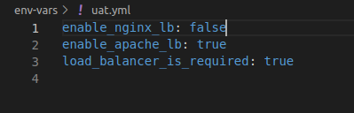

## ANSIBLE DYNAMIC ASSIGNMENTS AND COMMUNITY ROLE

### INTRODUCTION
Dynamic assignments are different from static assignments by the use of "include" moodule instead of "import" module. The main difference is that static assignment statements are pre-processed at the time playbooks are parsed, while dynamic assignment statements are only processed during the execution of the playbook. 

Ansible processes all playbooks referenced during the time it is parsing the statement in static assignment while for dynamic assignment, after parsing statements the changes to statements encountered during execution will be utilized.

The advantage offered by dynamic assignment is its use for specific variables, while its demerit is difficulty to debug due to its dynamic nature.

Community roles are quite handy and overcomes he need to "start from scratch". There are numerous roles which have been developed by other open source engineers that are available. These roles are production-ready and dynamic enough to accommodate most Linuv distros. **Ansible Galaxy** provides the required access to use a ready-made ansible role without bugs.

### PROJECT SETUP
Firstly, I created a new folder on the home directory of the Jenkins instance and cloned the ansible-congfig repo on github in it.
I created 2 new directory called **dynamic-assignments** with a file named *env-vars* and **env-vars** with .yaml files for each environment.


I pasted the instruction below into the env-vars.yml file:

```yaml
    ---
- name: collate variables from env specific file, if it exists
  hosts: all
  tasks:
    - name: looping through list of available files
      include_vars: "{{ item }}"
      with_first_found:
        - files:
            - dev.yml
            - stage.yml
            - prod.yml
            - uat.yml
          paths:
            - "{{ playbook_dir }}/../env-vars"
      tags:
        - always
```
Perusing the code above, we can see the use of  special variables playbook_dir and an inventory file. The playbook_dir directs Ansible to the location of the running playbook and other parts of the file system thereafter, while the inventory_file dynamically resolves to the name of the inventory file, appends .yaml in order to pick up the required file in the env-vars file.
The loop **with_first_found** implies that Ansible loops through the list of files and uses the first one it finds.

I created a role for MySQL database which would carry out the following functions:
* Install the MySQL package
* Create a database and configure users

This was carried out by using the following coed:
```bash
    ansible-galaxy install geerlingguy.mysql
```
afterwards, I changed the role directory name from *geerlingguy.mysql* to *mysql* and followed the instructions provided in the README.md file that accompanied it. 

I also created roles for Nginx and Apache from the community that was also developed by geerlingguy.


I followed the instructions on the README.md files accompanying the roles to configure the setup appropriately. 


While nginx and apache has been installed, I decided to activate the Apache load balancer by making use of variables **enable_nginx_lb** and **load_balancer_lb_required**.




